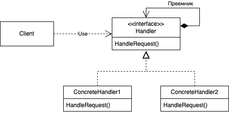

# Chain Of Responsibility
## Название и классификация паттерна
Цепочка обязанностей - паттерн поведения объектов
## Назначение
Позволяет избежать привязки отправителя запроса к его получателю, давая шанс обработать запрос нескольким объектам. Связывает объекты-получатели в цепочку и передает запрос вдоль этой цепочки, пока его не обработают.
## Мотивация
Рассмотрим контекстно-зависимую оперативную справку в графическом интерфейсе пользователя, который может получить дополнительную информацию по любой части интерфейса, просто щелкнув на ней мышью. Содержание справки зависит от того, какая часть интерфейса и в каком контексте выбрана. Например, справка по кнопке в диалоговом окне может отличаться от справки по аналогичной кнопке в главном окне приложения. Если для некоторой части интерфейса справки нет, то система должна показать информацию о ближайшем контексте, в котором она находится, например о диалоговом окне в целом.

Поэтому естественно было бы организовать справочную информацию от более конкретных разделов к более общим. Кроме того, ясно, что запрос на получение справки обрабатывается одним из нескольких объектов пользовательского интерфейса, каким именно – зависит от контекста и имеющейся в наличии информации.

Проблема в том, что объект, инициирующий запрос (например, кнопка), не располагает информацией о том, какой объект в конечном итоге предоставит справку. Нам необходим какой-то способ отделить кнопку-инициатор запроса от объектов, владеющих справочной информацией. Как этого добиться, показывает паттерн цепочка обязанностей.

Идея заключается в том, чтобы разорвать связь между отправителями и получателями, дав возможность обработать запрос нескольким объектам. Запрос перемещается по цепочке объектов, пока один из них не обработает его.

Первый объект в цепочке получает запрос и либо обрабатывает его сам, либо направляет следующему кандидату в цепочке, который ведет себя точно так же. У объекта, отправившего запрос, отсутствует информация об обработчике. Мы говорим, что у запроса есть анонимный получатель (implicit receiver).

Предположим, что пользователь запрашивает справку по кнопке Print (печать). Она находится в диалоговом окне PrintDialog, содержащем информацию об объекте приложения, которому принадлежит.

Чтобы отправить запрос по цепочке и гарантировать анонимность получателя, все объекты в цепочке имеют единый интерфейс для обработки запросов и для доступа к своему преемнику (следующему объекту в цепочке). Например, в системе оперативной справки можно было бы определить класс HelpHandler (предок классов всех объектов-кандидатов или подмешиваемый класс (mixin class)) с операцией HandleHelp. Тогда классы, которые будут обрабатывать запрос, смогут его передать своему родителю.
## Применимость
Используйте цепочку обязанностей, когда:
- есть более одного объекта, способного обработать запрос, причем настоящий обработчик заранее неизвестен и должен быть найден автоматически;
- вы хотите отправить запрос одному из нескольких объектов, не указывая явно, какому именно;
- набор объектов, способных обработать запрос, должен задаваться динамически.
## Структура

## Участники
- Handler - обработчик:
  - определяет интерфейс для обработки запросов
  - (необязательно) реализует связь с преемником
- ConcreteHandler - конкретный обработчик:
  - обрабатывает запрос, за который отвечает
  - имеет доступ к своему преемнику
  - если ConcreteHandler способен обработать запрос, то так и делает, если не может, то перенаправляет его своему преемнику
- Client - клиент
  - отправляет запрос некоторому объекту ConcreteHandler в цепочке
## Отношения
Когда клиент инициирует запрос, он продвигается по цепочке, пока некоторый объект ConcreteHandler не возьмет на себя ответственность за его обработку
## Результаты
Паттерн цепочка обязанностей имеет следующие достоинства и недостатки:
- ослабление связанности. Этот паттерн освобождает объект от необходимости «знать», кто конкретно обработает его запрос. Отправителю и получателю ни чего неизвестно друг о друге, а включенному в цепочку объекту – о структуре цепочки. Таким образом, цепочка обязанностей помогает упростить взаимосвязи между объектами. Вместо того чтобы хранить ссылки на все объекты, которые могут стать получателями запроса, объект должен располагать информацией лишь о своем ближайшем преемнике;
- дополнительная гибкость при распределении обязанностей между объектами. Цепочка обязанностей позволяет повысить гибкость распределения обязанностей между объектами. Добавить или изменить обязанности по обработке запроса можно, включив в цепочку новых участников или изменив ее каким-то другим образом. Этот подход можно сочетать со статическим порождением подклассов для создания специализированных обработчиков;
- получение не гарантировано. Поскольку у запроса нет явного получателя, то нет и гарантий, что он вообще будет обработан: он может достичь конца цепочки и пропасть. Необработанным запрос может оказаться и в случае не правильной конфигурации цепочки.
## Родственные паттерны
Паттерн цепочка обязанностей часто применяется вместе с паттерном [компоновщик](../../structural/composite/description.md). В этом случае родитель компонента может выступать в роли его преемника.
