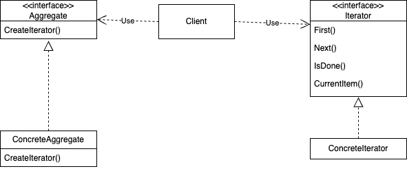

# Iterator
## Название и классификация паттерна
Итератор - паттерн поведения объектов
## Назначение
Предоставляет способ последовательного доступа ко всем элементам составного объекта, не раскрывая его внутреннего представления
## Alias
Cursor (курсор)
## Мотивация
Составной объект, скажем список, должен предоставлять способ доступа к своим элементам, не раскрывая их внутреннюю структуру. Более того, иногда требуется обходить список по-разному, в зависимости от решаемой задачи. Но вряд ли вы захотите засорять интерфейс класса List операциями для различных вариантов обхода, даже если все их можно предвидеть заранее. Кроме того, иногда нужно, что бы в один и тот же момент было определено несколько активных обходов списка.

Все это позволяет сделать паттерн итератор. Основная его идея в том, чтобы за доступ к элементам и способ обхода отвечал не сам список, а отдельный объект итератор. В классе Iterator определен интерфейс для доступа к элементам списка. Объект этого класса отслеживает текущий элемент, то есть он располагает информацией, какие элементы уже посещались.

Отделение механизма обхода от объекта List позволяет определять итераторы, реализующие различные стратегии обхода, не перечисляя их в интерфейсе класса List. Например, FilteringListIterator мог бы предоставлять доступ только к тем элементам, которые удовлетворяют условиям фильтрации.

Заметим: между итератором и списком имеется тесная связь, клиент должен иметь информацию, что он обходит именно список, а не какую-то другую агрегированную структуру. Поэтому клиент привязан к конкретному способу агрегирования. Было бы лучше, если бы мы могли изменять класс агрегата, не трогая код клиента. Это можно сделать, обобщив концепцию итератора и рассмотрев полиморфную итерацию. 

Например, предположим, что у нас есть еще класс SkipList, реализующий список. Список с пропусками (skiplist) – это вероятностная структура данных, по характеристикам напоминающая сбалансированное дерево. Нам нужно научиться писать код, способный работать с объектами как класса List, так и класса SkipList.

Остается понять, как создается итератор. Поскольку мы хотим написать код, не зависящий от конкретных подклассов List, то нельзя просто инстанцировать конкретный класс. Вместо этого мы поручим самим объектам-спискам создавать для себя подходящие итераторы, вот почему потребуется операция CreateIterator, посредством которой клиенты смогут запрашивать объект-итератор. CreateIterator– это пример использования паттерна фабричный метод.

В данном случае он служит для того, чтобы клиент мог запросить у объекта-списка подходящий итератор. Применение фабричного метода приводит к появлению двух иерархий классов – одной для списков, другой для итераторов. Фабричный метод CreateIterator «связывает» эти две иерархии.
## Применимость
Используйте паттерн итератор:
- для доступа к содержимому агрегированных объектов без раскрытия их внутреннего представления;
- для поддержки нескольких активных обходов одного и того же агрегированного объекта;
- для предоставления единообразного интерфейса с целью обхода различных агрегированных структур (то есть для поддержки полиморфной итерации).
## Структура

## Участники
- Iterator – итератор:
  - определяет интерфейс для доступа и обхода элементов;
- ConcreteIterator – конкретный итератор:
  - реализует интерфейс класса Iterator;
  - следит за текущей позицией при обходе агрегата;
- Aggregate – агрегат:
  - определяет интерфейс для создания объекта-итератора;
- ConcreteAggregate – конкретный агрегат:
  - реализует интерфейс создания итератора и возвращает экземпляр подходящего класса ConcreteIterator.
## Отношения
ConcreteIterator отслеживает текущий объект в агрегате и может вычислить идущий за ним.
## Результаты
У паттерна итератор есть следующие важные особенности:
- поддерживает различные виды обхода агрегата. Сложные агрегаты можно обходить по-разному. Например, для генерации кода и семантических проверок нужно обходить деревья синтаксического разбора. Генератор кода может обходить дерево во внутреннем или прямом порядке. Итераторы упрощают изменение алгоритма обхода – достаточно просто заменить один экземпляр итератора другим. Для поддержки новых видов обхода можно определить и подклассы класса Iterator ;
- итераторы упрощают интерфейс класса Aggregate. Наличие интерфейса для обхода в классе Iterator делает излишним дублирование этого интерфейса в классе Aggregate. Тем самым интерфейс агрегата упрощается;
- одновременно для данного агрегата может быть активно несколько обходов. Итератор следит за инкапсулированным в нем самом состоянием обхода. Поэтому одновременно разрешается осуществлять несколько обходов агрегата.
## Родственные паттерны
[Компоновщик](../../structural/composite/description.md): итераторы довольно часто применяются для обхода рекурсивных структур, создаваемых компоновщиком.

[Фабричный метод](../../creational/factory_method/description.md): полиморфные итераторы поручают фабричным методам инстанцировать подходящие подклассы класса Iterator.

Итератор может использовать хранитель для сохранения состояния итерации и при этом содержит его внутри себя.
