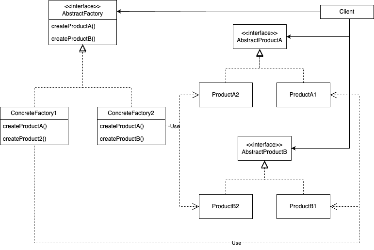

# Abstract Factory
## Название и классификация паттерна
Абстрактная фабрика - паттерн, порождающий объекты.
## Назначение
Предоставляет интерфейс для создания семейств взаимосвязанных или взаимозависимых объектов, не специфицируя их 
конкретных классов.
## Alias
Kit (инструментарий).
## Мотивация
Рассмотрим инструментальную программу для создания пользовательского интерфейса, поддерживающего разные стандарты 
внешнего облика, например Motif и Presentation Manager. Внешний облик определяет визуальное представление и поведение
элементов пользовательского интерфейса («виджетов») – полос прокрутки, окон и кнопок. Чтобы приложение можно было
перенести на другой стандарт, в нем не должен быть жестко закодирован внешний облик виджетов. Если инстанцирование 
классов для конкретного внешнего облика разбросано по всему приложению, то изменить облик впоследствии будет нелегко.

Мы можем решить эту проблему, определив абстрактный класс WidgetFactory, в котором объявлен интерфейс для создания всех
основных видов виджетов. Есть также абстрактные классы для каждого отдельного вида и конкретные под классы, реализующие
виджеты с определенным внешним обликом. В интерфейсе WidgetFactory имеется операция, возвращающая новый объектвиджет 
для каждого абстрактного класса виджетов. Клиенты вызывают эти операции для получения экземпляров виджетов, но при этом
ничего не знают о том, какие именно классы используют. Стало быть, клиенты остаются независимыми от выбранного стандарта
внешнего облика.

Для каждого стандарта внешнего облика существует определенный подкласс WidgetFactory. Каждый такой подкласс реализует
операции, необходимые для создания соответствующего стандарту виджета. Например, операция CreateScrollBar в классе 
MotifWidgetFactory инстанцирует и возвращает полосу прокрутки в стандарте Motif, тогда как соответствующая операция в 
классе PMWidgetFactory возвращает полосу прокрутки в стандарте Presentation Manager. Клиенты создают виджеты, пользуясь
исключительно интерфейсом WidgetFactory, и им ничего не известно о классах, реализующих виджеты для конкретного
стандарта. Другими словами, клиенты должны лишь придерживаться интерфейса, определенного абстрактным, а не конкретным 
классом.

Класс WidgetFactory также устанавливает зависимости между конкретными классами виджетов. Полоса прокрутки для Motif
должна использоваться с кнопкой и текстовым полем Motif, и это ограничение поддерживается автоматически, как следствие
использования класса MotifWidgetFactory.
## Применимость
Используйте паттерн абстрактная фабрика, когда:
- система не должна зависеть от того, как создаются, компонуются и представляются входящие в неё объекты
- входящие в семейство взаимосвязанные объекты должны использоваться вместе и вам необходимо обеспечить выполнение 
этого ограничения
- система должна конфигурироваться одним из семейств составляющих её объектов
- вы хотите предоставить библиотеку объектов, раскрывая только их интерфейсы, но не реализацию
## Структура

## Участники
- Abstract Factory - абстрактная фабрика, который объявляет интерфейс для операций, создающих абстрактные 
объекты-продукты
- Concrete Factory - конкретная фабрика, которая реализует операции, создающие конкретные объекты-продукты
- Abstract Product - абстрактный продукт - объявляет интерфейс для типа объекта-продукта
- Concrete Product - конкретный продукт - определяет объект-продукт, создаваемый соответствующей конкретной фабрикой
- Client - клиент, который пользуется исключительно интерфейсами, которые объявлены в классах AbstractFactory и 
AbstractProduct
## Отношения
- Обычно во время выполнения создаётся единственный экземпляр класса ConcreteFactory. Эта конкретная фабрика создаёт 
объекты-продукты, имеющие вполне определённую реализацию. Для создания других видов объектов клиент должен 
воспользоваться другой конкретной фабрикой
- AbstractFactory передоверяет создание объектов-продуктов своему классу ConcreteFactory
## Результаты
Паттерн абстрактная фабрика обладает следующими плюсами и минусами:
- изолирует конкретные классы
- упрощает замену семейств продуктов
- гарантирует сочетаемость продуктов
- поддерживать новый вид продуктов трудно
## Родственные паттерны
Классы AbstractFactory часто реализуются [фабричными методами](../factory_method/description.md), но могут быть реализованы и с помощью паттерна [прототип](../prototype/description.md).
Конкретная фабрика часто описывается паттерном [одиночка](../singleton/description.md).
