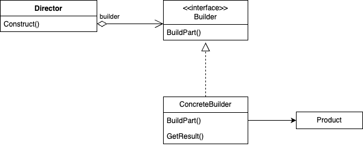

# Builder
## Название и классификация паттерна
Строитель - паттерн, порождающий объекты.
## Назначение
Отделяет конструирование сложного объекта от его представления, так что в результате одного и того же процесса 
конструирования могут получаться различные представления.
## Мотивация
Программа, в которую заложена возможность распознавания и чтения документа в формате RTF (Rich Text Format), должна 
также «уметь» преобразовывать его во многие другие форматы, например в простой ASCIIтекст или в представление, которое 
можно отобразить в виджете для ввода текста. Однако число вероятных преобразований заранее неизвестно. Поэтому должна
быть обеспечена возможность без труда добавлять новый конвертор.

Таким образом, нужно сконфигурировать класс RTFReader с помощью объекта TextConverter, который мог бы преобразовывать 
RTF в другой текстовый формат. При разборе документа в формате RTF класс RTFReader вызывает TextConverter для выполнения
преобразования. Всякий раз, как RTFReader распознает лексему RTF (простой текст или управляющее слово), для ее 
преобразования объекту TextConverter посылается запрос. Объекты TextConverter отвечают как за преобразование данных, 
так и за представление лексемы в конкретном формате.

Подклассы TextConverter специализируются на различных преобразованиях и форматах. Например, ASCIIConverter игнорирует 
запросы на преобразование чего бы то ни было, кроме простого текста. С другой стороны, TeXConverter будет реализовывать
все запросы для получения представления в формате редактора TЕX, собирая по ходу необходимую информацию о стилях. А 
TextWidgetConverter станет строить сложный объект пользовательского интерфейса, который позволит пользователю 
просматривать и редактировать текст.

Класс каждого конвертора принимает механизм создания и сборки сложного объекта и скрывает его за абстрактным 
интерфейсом. Конвертор отделен от загрузчика, который отвечает за синтаксический разбор RTFдокумента.

В паттерне строитель абстрагированы все эти отношения. В нем любой класс конвертора называется строителем, а загрузчик
– распорядителем. В применении к рассмотренному примеру строитель отделяет алгоритм интерпретации формата текста (то
есть анализатор RTFдокументов) от того, как создается и представляется документ в преобразованном формате. Это
позволяет повторно использовать алгоритм разбора, реализованный в RTFReader, для создания разных текстовых 
представлений RTFдокументов; достаточно передать в RTFReader различные под классы класса TextConverter.
## Применимость
Используйте паттерн Строитель, когда:
- алгоритм создания сложного объекта не должен зависеть от того, из каких частей состоит объект и как они стыкуются 
между собой
- процесс конструирования должен обеспечивать различные представления конструируемого объекта
## Структура

## Участники
- Builder - строитель - задаёт абстрактный интерфейс для создания частей объекта Product
- ConcreteBuilder - конкретный строитель:
  - конструирует и собирает вместе части продукта посредством реализации интерфейса Builder
  - определяет создаваемое представление и следит за ним
  - предоставляет интерфейс для доступа к продукту
- Director - распорядитель - конструирует объект, пользуясь интерфейсом Builder
- Product - продукт:
  - представляет сложный конструируемый объект. ConcreteBuilder строит внутреннее представление продукта и определяет 
процесс его сборки
  - включает классы, которые определяют составные части, в т.ч. интерфейсы для сборки конечного результата
## Отношения
- клиент создаёт объект-распорядитель и конфигурирует его нужным объектом-строителем Builder
- распорядитель уведомляет строителя о том, что нужно построить очередную часть продукта
- строитель обрабатывает запросы распорядителя и добавляет новые части к продукту
- клиент забирает продукт у строителя
## Результаты
Плюсы и минусы паттерна строитель и его применения:
- позволяет изменять внутреннее представление продукта
- изолирует код, реализующий конструирование и представление
- даёт более тонкий контроль над процессом конструирования
## Родственные паттерны
[Абстрактная фабрика](../abstract_factory/description.md) похожа на строитель в том смысле, что может конструировать 
сложные объекты. Основное различие между ними в том, что строитель делает акцент на пошаговом конструировании объекта, 
а абстрактная фабрика – на создании семейств объектов (простых или сложных). Строитель возвращает продукт на последнем
шаге, тогда как с точки зрения абстрактной фабрики продукт возвращается немедленно.

Паттерн компоновщик – это то, что часто создает строитель.