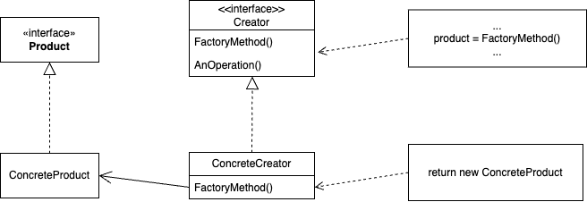

# Factory Method
## Название и классификация паттерна
Фабричный метод - паттерн, порождающий классы.
## Назначение
Определяет интерфейс для создания объекта, но оставляет подклассам решение о том, какой класс инстанцировать. Фабричный метод позволяет классу делегировать инстанцирование подклассам.
## Alias
Virtual Constructor (виртуальный конструктор).
## Мотивация
Каркасы пользуются абстрактными классами для определения и поддержания отношений между объектами. Кроме того, каркас часто отвечает за создание самих объектов.

Рассмотрим каркас для приложений, способных представлять пользователю сразу несколько документов. Две основных абстракции в таком каркасе – это классы Application и Document. Оба класса абстрактные, поэтому клиенты должны порождать от них подклассы для создания специфичных для приложения реализаций. Например, чтобы создать приложение для рисования, мы определим классы DrawingApplication и DrawingDocument. Класс Application отвечает за управление документами и создает их по мере необходимости, допустим, когда пользователь выбирает из меню пункт Open (открыть) или New (создать).

Поскольку решение о том, какой подкласс класса Document инстанцировать, зависит от приложения, то Application не может «предсказать», что именно понадобится. Этому классу известно лишь, когда нужно инстанцировать новый документ, а не какой документ создать. Возникает дилемма: каркас должен инстанцировать классы, но «знает» он лишь об абстрактных классах, которые инстанцировать нельзя.

Решение предлагает паттерн фабричный метод. В нем инкапсулируется информация о том, какой подкласс класса Document создать, и это знание выводится за пределы каркаса.

Подклассы класса Application переопределяют абстрактную операцию CreateDocument таким образом, чтобы она возвращала подходящий подкласс класса Document. Как только подкласс Application инстанцирован, он может инстанцировать специфические для приложения документы, ничего не зная об их классах. Операцию CreateDocument мы называем фабричным методом, поскольку она отвечает за «изготовление» объекта.
## Применимость
Используйте паттерн фабричный метод, когда:
- классу заранее неизвестно, объекты каких классов ему нужно создавать
- класс спроектирован так, чтобы объекты, которые он создаёт, специфицировались подклассами
- класс делегирует свои обязанности одному из нескольких вспомогательных подклассов, и вы планируете локализовать знание о том, какой класс принимает эти обязанности на себя
## Структура

## Участники
- Product - продукт:
  - определяет интерфейс объектов, создаваемых фабричным методом
- ConcreteProduct - конкретный продукт:
  - реализует интерфейс Product
- Creator - создатель:
  - объявляет фабричный метод, возвращающий объект типа Product. Creator может также определять реализацию по умолчанию фабричного метода, который возвращает объект ConcreteProduct
  - может вызывать фабричный метод для создания объекта Product
- ConcreteCreator - конкретный создатель:
  - замещает фабричный метод, возвращающий объект ConcreteProduct
## Отношения
Создатель полагается на свои подклассы в определении фабричного метода, который будет возвращать экземпляр подходящего конкретного продукта
## Результаты
Фабричные методы избавляют проектировщика от необходимости встраивать в код зависящие от приложения классы. Код имеет дело только с интерфейсом класса Product, поэтому он может работать с любыми определенными пользователями классами конкретных продуктов.

Потенциальный недостаток фабричного метода состоит в том, что клиентам, возможно, придется создавать подкласс класса Creator для создания лишь одного объекта ConcreteProduct. Порождение подклассов оправдано, если клиенту так или иначе приходится создавать подклассы Creator, в противном случае клиенту придется иметь дело с дополнительным уровнем подклассов. А вот еще два последствия применения паттерна фабричный метод:
- предоставляет подклассам операциизацепки (hooks). Создание объектов внутри класса с помощью фабричного метода всегда оказывается более гибким решением, чем непосредственное создание. Фабричный метод создает в подклассах операциизацепки для предоставления расширенной версии объекта. В примере с документом класс Document мог бы определить фабричный метод CreateFileDialog, который создает диалоговое окно для выбора файла существующего документа. Подкласс этого класса мог бы определить специализированное для приложения диалоговое окно, заместив этот фабричный метод. В данном случае фабричный метод не является абстрактным, а содержит разумную реализацию по умолчанию;
- соединяет параллельные иерархии. В примерах, которые мы рассматривали до сих пор, фабричные методы вызывались только создателем. Но это совершенно необязательно: клиенты тоже могут применять фабричные методы, особенно при наличии параллельных иерархий классов. Параллельные иерархии возникают в случае, когда класс делегирует часть своих обязанностей другому классу, не являющемуся производным от него. Рассмотрим, например, графические фигуры, которыми можно манипулировать интерактивно: растягивать, двигать или вращать с помощью мыши. Реализация таких взаимодействий с пользователем – не всегда простое дело. Часто приходится сохранять и обновлять информацию о текущем со стоянии манипуляций. Но это состояние нужно только во время самой манипуляции, поэтому помещать его в объект, представляющий фигуру, не следует. К тому же фигуры ведут себя поразному, когда пользователь манипулирует ими. Например, растягивание отрезка может сводиться к изменению положения концевой точки, а растягивание текста – к изменению междустрочных интервалов. При таких ограничениях лучше использовать отдельный объектманипулятор Manipulator, который реализует взаимодействие и контролирует его текущее состояние. У разных фигур будут разные манипуляторы, являющиеся подклассом Manipulator. Получающаяся иерархия класса Manipulator параллельна (по крайней мере, частично) иерархии класса Figure. Класс Figure предоставляет фабричный метод CreateManipulator, который позволяет клиентам создавать соответствующий фигуре манипулятор. Подклассы Figure замещают этот метод так, чтобы он возвращал подходящий для них подкласс Manipulator. Вместо этого класс Figure может реализовать CreateManipulator так, что он будет возвращать экземпляр класса Manipulator по умолчанию, а подклассы Figure могут наследовать это умолчание. Те классы фигур, которые функционируют по описанному принципу, не нуждаются в специальном манипуляторе, поэтому иерархии параллельны только отчасти. Обратите внимание, как фабричный метод определяет связь между обеими иерархиями классов. В нем локализуется знание о том, какие классы способны работать совместно.
## Родственные паттерны
[Абстрактная фабрика](../abstract_factory/description.md) часто реализуется с помощью фабричных методов. Пример в разделе «Мотивация» из описания абстрактной фабрики иллюстрирует также и паттерн фабричные методы. Паттерн фабричные методы часто вызывается внутри шаблонных методов. В примере с документами NewDocument– это шаблонный метод. [Прототипы](../prototype/description.md) не нуждаются в порождении подклассов от класса Creator. Однако им часто бывает необходима операция Initialize в классе Product. Creator использует Initialize для инициализации объекта. Фабричному методу такая операция не требуется.
