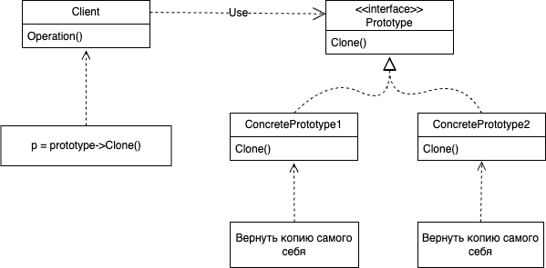

# Prototype
## Название и классификация паттерна
Прототип - паттерн, порождающий объекты
## Назначение
Задаёт виды создаваемых объектов с помощью экземпляра-прототипа и создаёт новые объекты этого прототипа
## Мотивация
Построить музыкальный редактор удалось бы путем адаптации общего каркаса графических редакторов и добавления новых объектов, представляющих ноты, паузы и нотный стан. В каркасе редактора может присутствовать палитра инструментов для добавления в партитуру этих музыкальных объектов. Палитра может также содержать инструменты для выбора, перемещения и иных манипуляций с объектами. Так, пользователь, щелкнув, например, по значку четверти поместил бы ее тем самым в партитуру. Или, применив инструмент перемещения, сдвигал бы ноту на стане вверх или вниз, чтобы изменить ее высоту.

Предположим, что каркас предоставляет абстрактный класс Graphic для графических компонентов вроде нот и нотных станов, а также абстрактный класс Tool для определения инструментов в палитре. Кроме того, в каркасе имеется предопределенный подкласс GraphicTool для инструментов, которые создают графические объекты и добавляют их в документ.

Однако класс GraphicTool создает некую проблему для проектировщика каркаса. Классы нот и нотных станов специфичны для нашего приложения, а класс GraphicTool принадлежит каркасу. Этому классу ничего неизвестно о том, как создавать экземпляры наших музыкальных классов и добавлять их в партитуру. Можно было бы породить от GraphicTool подклассы для каждого вида музыкальных объектов, но тогда оказалось бы слишком много классов, отличающихся только тем, какой музыкальный объект они инстанцируют. Мы знаем, что гибкой альтернативой порождению подклассов является композиция. Вопрос в том, как каркас мог бы воспользоваться ею для параметризации экземпляров GraphicTool классом того объекта Graphic, который предполагается создать.

Решение – заставить GraphicTool создавать новый графический объект, копируя или «клонируя» экземпляр подкласса класса Graphic. Этот экземпляр мы будем называть прототипом. GraphicTool параметризуется прототипом, который он должен клонировать и добавить в документ. Если все подклассы Graphic поддерживают операцию Clone, то GraphicTool может клонировать любой вид графических объектов.

Итак, в нашем музыкальном редакторе каждый инструмент для создания музыкального объекта – это экземпляр класса GraphicTool, инициализированный тем или иным прототипом. Любой экземпляр GraphicTool будет создавать музыкальный объект, клонируя его прототип и добавляя клон в партитуру.

Можно воспользоваться паттерном прототип, чтобы еще больше сократить число классов. Для целых и половинных нот у нас есть отдельные классы, но, быть может, это излишне. Вместо этого они могли бы быть экземплярами одного и того же класса, инициализированного разными растровыми изображениями и длительностями звучания. Инструмент для создания целых нот становится просто объектом класса GraphicTool, в котором прототип MusicalNote инициализирован целой нотой. Это может значительно уменьшить число классов в системе. Заодно упрощается добавление нового вида нот в музыкальный редактор.
## Применимость
Используйте паттерн прототип, когда система не должна зависеть от того, как в ней создаются, компонуются и представляются продукты:
- инстанцируемые классы определяются во время выполнения, например, с помощью динамической загрузки
- для того чтобы избежать построения иерархий классов или фабрик, параллельных иерархии классов продуктов
- экземпляры класса могут находиться в одном из не очень большого числа различных состояний. Может оказаться удобнее установить соответствующее число прототипов и клонировать их, а не инстанцировать каждый раз класс вручную в подходящем состоянии
## Структура

## Участники
- Prototype - прототип:
  - объявляет интерфейс для клонирования самого себя
- ConcretePrototype - конкретный прототип
  - реализует операцию клонирования самого себя
- Client - клиент
  - создаёт новый объект, обращаясь к прототипу с запросом клонировать самого себя
## Отношения
Клиент обращается к прототипу, чтобы тот создал свою копию
## Результаты
У прототипа те же самые результаты, что у абстрактной фабрики и строителя: он скрывает от клиента конкретные классы продуктов, уменьшая тем самым число известных клиенту имен. Кроме того, все эти паттерны позволяют клиентам работать со специфичными для приложения классами без модификаций.

Ниже перечислены дополнительные преимущества паттерна прототип:
- добавление и удаление продуктов во время выполнения. Прототип позволяет включать новый конкретный класс продуктов в систему, просто сообщив клиенту о новом экземплярепрототипе. Это несколько более гибкое решение по сравнению с тем, что удастся сделать с помощью других порождающих паттернов, ибо клиент может устанавливать и удалять прототипы во время выполнения;
- спецификация новых объектов путем изменения значений. Динамичные системы позволяют определять поведение за счет композиции объектов – например, путем задания значений переменных объекта, – а не с помощью определения новых классов. По сути дела, вы определяете новые виды объектов, инстанцируя уже существующие классы и регистрируя их экземпляры как прототипы клиентских объектов. Клиент может изменить поведение, делегируя свои обязанности прототипу. Такой дизайн позволяет пользователям определять новые классы без программирования. Фактически клонирование объекта аналогично инстанцированию класса. Паттерн прототип может резко уменьшить число необходимых системе классов. В нашем музыкальном редакторе с помощью одного только класса GraphicTool удастся создать бесконечное разнообразие музыкальных объектов;
- специфицирование новых объектов путем изменения структуры. Многие приложения строят объекты из крупных и мелких составляющих. Например, редакторы для проектирования печатных плат создают электрические схемы из подсхем.1 Такие приложения часто позволяют инстанцировать сложные, определенные пользователем структуры, скажем, для многократного использования некоторой подсхемы. Паттерн прототип поддерживает и такую возможность. Мы просто добавляем подсхему как прототип в палитру доступных элементов схемы. При условии, что объект, представляющий составную схему, реализует операцию Clone как глубокое копирование, схемы с разными структурами могут выступать в качестве прототипов;
- уменьшение числа подклассов. Паттерн фабричный метод часто порождает иерархию классов Creator, параллельную иерархии классов продуктов. Прототип позволяет клонировать прототип, а не запрашивать фабричный метод создать новый объект. Поэтому иерархия класса Creator становится вообще ненужной. Это преимущество касается главным образом языков типа C++, где классы не рассматриваются как настоящие объекты. В языках же типа Smalltalk и Objective C это не так существенно, поскольку всегда можно использовать объекткласс в качестве создателя. В таких языках объекты классы уже выступают как прототипы;
- динамическое конфигурирование приложения классами. Некоторые среды позволяют динамически загружать классы в приложение во время его выполнения. Паттерн прототип – это ключ к применению таких возможностей в языке типа C++. Приложение, которое создает экземпляры динамически загружаемого класса, не может обращаться к его конструктору статически. Вместо этого исполняющая среда автоматически создает экземпляр каждого класса в момент его загрузки и регистрирует экземпляр в диспетчере прототипов (см. раздел «Реализация»). Затем приложение может запросить у диспетчера прототипов экземпляры вновь загруженных классов, которые изначально не были связаны с программой. Каркас приложений ET++ [WGM88] в своей исполняющей среде использует именно такую схему.

Основной недостаток паттерна прототип заключается в том, что каждый под класс класса Prototype должен реализовывать операцию Clone, а это далеко не всегда просто. Например, сложно добавить операцию Clone, когда рассматриваемые классы уже существуют. Проблемы возникают и в случае, если во внутреннем представлении объекта есть другие объекты или наличествуют круговые ссылки.
## Родственные паттерны
В некоторых отношениях прототип и [абстрактная фабрика](../abstract_factory/description.md) являются конкурентами. Но их используют и совместно. Абстрактная фабрика может хранить набор прототипов, которые клонируются и возвращают изготовленные объекты. В тех проектах, где активно применяются паттерны [компоновщик](../../structural/composite/description.md) и [декоратор](../../structural/decorator/description.md), тоже можно извлечь пользу из прототипа.
