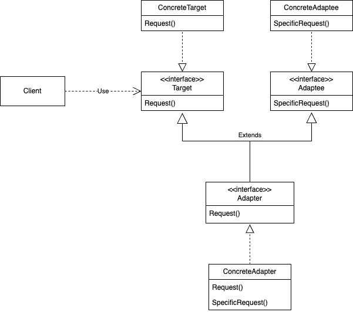

# Adapter
## Название и классификация паттерна
Адаптер - паттерн, структурирующий классы и объекты
## Назначение
Преобразует интерфейс одного класса в интерфейс другого, который ожидают клиенты. Адаптер обеспечивает совместную работу классов с несовместимыми интерфейсами, которая без него была бы невозможна
## Alias
Wrapper (обёртка)
## Мотивация
Иногда класс из инструментальной библиотеки, спроектированный для повторного использования, не удается использовать только потому, что его интерфейс не соответствует тому, который нужен конкретному приложению. 

Рассмотрим, например, графический редактор, благодаря которому пользователи могут рисовать на экране графические элементы (линии, многоугольники, текст и т.д.) и организовывать их в виде картинок и диаграмм. Основной абстракцией графического редактора является графический объект, который имеетизменяемую форму и изображает сам себя. Интерфейс графических объектов определен абстрактным классом Shape. Редактор определяет подкласс класса Shape для каждого вида графических объектов: LineShape для прямых, PolygonShape для многоугольников и т.д.

Классы для элементарных геометрических фигур, например LineShape и PolygonShape, реализовать сравнительно просто, поскольку заложенные в них возможности рисования и редактирования крайне ограничены. Но подкласс TextShape, умеющий отображать и редактировать текст, уже значительно сложнее, поскольку даже для простейших операций редактирования текста нужно нетривиальным образом обновлять экран и управлять буферами. В то же время, возможно, существует уже готовая библиотека для разработки пользовательских интерфейсов, которая предоставляет развитый класс TextView, позволяющий отображать и редактировать текст. В идеале мы хотели бы повторно использовать TextView для реализации TextShape, но библиотека разрабатывалась без учета классов Shape, поэтому заставить объекты TextView и Shape работать совместно не удается.

Так каким же образом существующие и независимо разработанные классы вроде TextView могут работать в приложении, которое спроектировано под другой, несовместимый интерфейс? Можно было бы так изменить интерфейс класса TextView, чтобы он соответствовал интерфейсу Shape, только для этого нужен исходный код. Но даже если он доступен, то вряд ли разумно изменять TextView; библиотека не должна приспосабливаться к интерфейсам каждого конкретного приложения.

Вместо этого мы могли бы определить класс TextShape так, что он будет адаптировать интерфейс TextView к интерфейсу Shape. Это допустимо сделать двумя способами: наследуя интерфейс от Shape, а реализацию от TextView; включив экземпляр TextView в TextShape и реализовав TextShape в терминах интерфейса TextView. Два данных подхода соответствуют вариантам паттерна адаптер в его классовой и объектной ипостасях. Класс TextShape мы будем называть адаптером.

Часто адаптер отвечает за функциональность, которую не может предоставить адаптируемый класс. На диаграмме показано, как адаптер выполняет такого рода функции. У пользователя должна быть возможность перемещать любой объект класса Shape в другое место, но в классе TextView такая операция не предусмотрена. TextShape может добавить недостающую функциональность, самостоятельно реализовав операцию CreateManipulator класса Shape, которая возвращает экземпляр подходящего подкласса Manipulator. Manipulator– это абстрактный класс объектов, которым известно, как анимировать Shape в ответ на такие действия пользователя, как перетаскивание фигуры в другое место. У класса Manipulator имеются подклассы для различных фигур. Например, TextManipulator– подкласс для TextShape. Возвращая экземпляр TextManipulator, объект класса TextShape добавляет новую функциональность, которой в классе TextView нет, а классу Shape требуется.
## Применимость
Применяйте паттерн адаптер, когда:
- хотите использовать существующий класс, но его интерфейс не соответствует вашим потребностям; 
- собираетесь создать повторно используемый класс, который должен взаимодействовать с заранее неизвестными или не связанными с ним классами, имеющими несовместимые интерфейсы; 
- (только для адаптера объектов!) нужно использовать несколько существующих подклассов, но непрактично адаптировать их интерфейсы путем порождения новых подклассов от каждого. В этом случае адаптер объектов может приспосабливать интерфейс их общего родительского класса.
## Структура
Адаптер класса использует множественное наследование для адаптации одного интерфейса к другому.

Адаптер объекта применяет композицию объектов.
## Участники
- Target - целевой:
  - определяет зависящий от предметной области интерфейс, которым пользуется Client
- Client - клиент:
  - вступает во взаимоотношения с объектами, удовлетворяющими интерфейсу Target
- Adaptee - адаптируемый:
  - определяет существующий интерфейс, который нуждается в адаптации
- Adapter - адаптер:
  - адаптирует интерфейс Adaptee к интерфейсу Target
## Отношения
Результаты применения адаптеров объектов и классов различны. 

Адаптер класса:
- адаптирует Adaptee к Target, перепоручая действия конкретному классу Adaptee. Поэтому данный паттерн не будет работать, если мы захотим одновременно адаптировать класс и его подклассы;
- позволяет адаптеру Adapter заместить некоторые операции адаптируемого класса Adaptee, так как Adapter есть не что иное, как подкласс Adaptee;
- вводит только один новый объект. Чтобы добраться до адаптируемого класса, не нужно никакого дополнительного обращения по указателю. 

Адаптер объектов:
- позволяет одному адаптеру Adapter работать со многим адаптируемыми объектами Adaptee, то есть с самим Adaptee и его подклассами (если таковые имеются). Адаптер может добавить новую функциональность сразу всем адаптируемым объектам;
- затрудняет замещение операций класса Adaptee. Для этого потребуется породить от Adaptee подкласс и заставить Adapter ссылаться на этот под класс, а не на сам Adaptee.

Ниже приведены вопросы, которые следует рассмотреть, когда вы решаете применить паттерн адаптер:
- объем работы по адаптации. Адаптеры сильно отличаются по тому объему работы, который необходим для адаптации интерфейса Adaptee к интерфейсу Target. Это может быть как простейшее преобразование, например изменение имен операций, так и поддержка совершенно другого набора операций. Объем работы зависит от того, насколько сильно отличаются друг от друга интерфейсы целевого и адаптируемого классов;
- сменные адаптеры. Степень повторной используемости класса тем выше, чем меньше предположений делается о тех классах, которые будут его применять. Встраивая адаптацию интерфейса в класс, вы отказываетесь от предположения, что другим классам станет доступен тот же самый интерфейс. Другими словами, адаптация интерфейса позволяет включить ваш класс в существующие системы, которые спроектированы для класса с другим интерфейсом. В системе ObjectWorks\Smalltalk [Par90] используется термин сменный адаптер (pluggable adapter) для обозначения классов со встроенной адаптацией интерфейса. Рассмотрим виджет TreeDisplay, позволяющий графически отображать древовидные структуры. Если бы это был специализированный виджет, предназначенный только для одного приложения, то мы могли бы потребовать специального интерфейса от объектов, которые он отображает. Но если мы хотим сделать его повторно используемым (например, частью библиотеки полезных виджетов), то предъявлять такое требование неразумно. Разные приложения, скорей всего, будут определять собственные классы для представления древовидных структур, и не следует заставлять их пользоваться именно нашим абстрактным классом Tree. А у разных структур деревьев будут и разные интерфейсы. Например, в иерархии каталогов добраться до потомков удастся с помощью операции GetSubdirectories, тогда как для иерархии наследования со ответствующая операция может называться GetSubclasses. Повторно используемый виджет TreeDisplay должен «уметь» отображать иерархии обоих видов, даже если у них разные интерфейсы. Другими словами, в TreeDisplay должна быть встроена возможность адаптации интерфейсов. О способах встраивания адаптации интерфейсов в классы говорится в разделе «Реализация»;
- использование двусторонних адаптеров для обеспечения прозрачности. Адаптеры непрозрачны для всех клиентов. Адаптированный объект уже не обладает интерфейсом Adaptee, так что его нельзя использовать там, где Adaptee был применим. Двусторонние адаптеры способны обеспечить такую прозрачность. Точнее, они полезны в тех случаях, когда клиент должен видеть объект поразному. Рассмотрим двусторонний адаптер, который интегрирует каркас графических редакторов Unidraw [VL90] и библиотеку для разрешения ограничений QOCA [HHMV92]. В обеих системах есть классы, явно представляющие переменные: в Unidraw это StateVariable, а в QOCA – ConstraintVariable. Чтобы заставить Unidraw работать совместно с QOCA, ConstraintVariable нужно адаптировать к StateVariable. А для того чтобы решения QOCA распространялись на Unidraw, StateVariable следует адаптировать к ConstraintVariable.
## Результаты
Хотя реализация адаптера обычно не вызывает затруднений, кое о чем все же стоит помнить:
- реализация адаптеров классов в C++. В C++ реализация адаптера класса Adapter открыто наследует от класса Target и закрыто – от Adaptee. Таким образом, Adapter должен быть подтипом Target, но не Adaptee;
- сменные адаптеры. Рассмотрим три способа реализации сменных адаптеров для описанного выше виджета TreeDisplay, который может автоматически отображать иерархические структуры. Первый шаг, общий для всех трех реализаций, – найти «узкий» интерфейс для Adaptee, то есть наименьшее подмножество операций, позволяющее выполнить адаптацию. «Узкий» интерфейс, состоящий всего из пары итераций, легче адаптировать, чем интерфейс из нескольких десятков операций. Для TreeDisplay адаптации подлежит любая иерархическая структура. Минимальный интерфейс мог бы включать всего две операции: одна определяет графическое представление узла в иерархической структуре, другая – доступ к потомкам узла. «Узкий» интерфейс приводит к трем подходам к реализации:
  - использование абстрактных операций. Определим в классе TreeDisplay абстрактные операции, которые соответствуют «узкому» интерфейсу класса Adaptee. Подклассы должны реализовывать эти абстрактные операции и адаптировать иерархически структурированный объект. Например, подкласс DirectoryTreeDisplay при их реализации будет осуществлять доступ к структуре каталогов файловой системы. DirectoryTreeDisplay специализирует узкий интерфейс таким образом, чтобы он мог отображать структуру каталогов, составленную из объектов FileSystemEntity;
  - использование объектовуполномоченных. При таком подходе TreeDisplay переадресует запросы на доступ к иерархической структуре объекту уполномоченному. TreeDisplay может реализовывать различные стратегии адаптации, подставляя разных уполномоченных. Например, предположим, что существует класс DirectoryBrowser, который использует TreeDisplay. DirectoryBrowser может быть уполномоченным для адаптации TreeDisplay к иерархической структуре каталогов. В динамически типизированных языках вроде Smalltalk или Objective C такой подход требует интерфейса для регистрации уполномоченного в адаптере. Тогда TreeDisplay просто переадресует запросы уполномоченному. В системе NEXTSTEP [Add94] этот подход активно используется для уменьшения числа подклассов. В статически типизированных языках вроде C++ требуется явно определять интерфейс для уполномоченного. Специфицировать такой интерфейс можно, поместив «узкий» интерфейс, который необходим классу TreeDisplay, в абстрактный класс TreeAccessorDelegate. После этого допустимо добавить этот интерфейс к выбранному уполномоченному – в данном случае DirectoryBrowser– с помощью наследования. Если у DirectoryBrowser еще нет существующего родительского класса, то воспользуемся одиночным наследованием, если есть – множественным. Подобное смешивание классов проще, чем добавление нового подкласса и реализация его операций по отдельности;
  - параметризованные адаптеры. Обычно в Smalltalk для поддержки сменных адаптеров параметризуют адаптер одним или несколькими блоками. Конструкция блока поддерживает адаптацию без порождения подклассов. Блок может адаптировать запрос, а адаптер может хранить блок для каждого отдельного запроса. В нашем примере это означает, что TreeDisplay хранит один блок для преобразования узла в GraphicNode, а другой – для доступа к потомкам узла.
## Родственные паттерны
Структура паттерна [мост](../bridge/description.md) аналогична структуре адаптера, но у моста иное назначение. Он отделяет интерфейс от реализации, чтобы то и другое можно было изменять независимо. Адаптер же призван изменить интерфейс существующего объекта.

Паттерн декоратор расширяет функциональность объекта, изменяя его интерфейс. Таким образом, декоратор более прозрачен для приложения, чем адаптер. Как следствие, декоратор поддерживает рекурсивную композицию, что для «чистых» адаптеров невозможно. 

Заместитель определяет представителя или суррогат другого объекта, но не изменяет его интерфейс.
