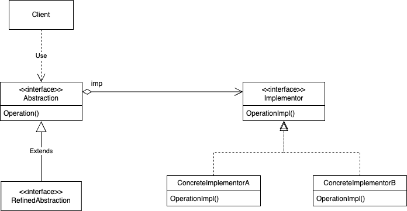

# Bridge
## Назначение и классификация паттерна
Мост - паттерн, структурирующий объекты
## Назначение
Отделить абстракцию от её реализации так, чтобы то и другое можно было изменять независимо.
## Alias
Handle/Body (описатель/тело).
## Мотивация
Если для некоторой абстракции возможно несколько реализаций, то обычно применяют наследование. Абстрактный класс определяет интерфейс абстракции, а его конкретные подклассы поразному реализуют его. Но такой подход не всегда обладает достаточной гибкостью. Наследование жестко привязывает реализацию к абстракции, что затрудняет независимую модификацию, расширение и повторное использование абстракции и ее реализации.

Рассмотрим реализацию переносимой абстракции окна в библиотеке для раз работки пользовательских интерфейсов. Написанные с ее помощью приложения должны работать в разных средах, например под X Window System и Presentation Manager (PM) от компании IBM. С помощью наследования мы могли бы определить абстрактный класс Window и его подклассы XWindow и PMWindow, реализующие интерфейс окна для разных платформ. Но у такого решения есть два недостатка:
- неудобно распространять абстракцию Window на другие виды окон или новые платформы. Представьте себе подкласс IconWindow, который специализирует абстракцию окна для пиктограмм. Чтобы поддержать пиктограммы на обеих платформах, нам придется реализовать два новых подкласса XIconWindow и PMIconWindow. Более того, по два подкласса необходимо определять для каждого вида окон. А для поддержки третьей платформы придется определять для всех видов окон новый подкласс Window;
- клиентский код становится платформеннозависимым. При создании окна клиент инстанцирует конкретный класс, имеющий вполне определенную реализацию. Например, создавая объект XWindow, мы привязываем абстракцию окна к ее реализации для системы X Window и, следовательно, делаем код клиента ориентированным именно на эту оконную систему. Таким образом усложняется перенос клиента на другие платформы. Клиенты должны иметь возможность создавать окно, не привязываясь к конкретной реализации. Только сама реализация окна должна зависеть от платформы, на которой работает приложение. Поэтому в клиентском коде не может быть никаких упоминаний о платформах.

С помощью паттерна мост эти проблемы решаются. Абстракция окна и ее реализация помещаются в раздельные иерархии классов. Таким образом, существует одна иерархия для интерфейсов окон (Window, IconWindow, TransientWindow) и другая (с корнем WindowImp) – для платформеннозависимых реализаций. Так, подкласс XWindowImp предоставляет реализацию в системе X Window System.

Все операции подклассов Window реализованы в терминах абстрактных операций из интерфейса WindowImp. Это отделяет абстракцию окна от различных ее платформеннозависимых реализаций. Отношение между классами Window и WindowImp мы будем называть мостом, поскольку между абстракцией и реализацией строится мост, и они могут изменяться независимо
## Применимость
Используйте паттерн мост, когда:
- хотите избежать постоянной привязки абстракции к реализации. Так, на пример, бывает, когда реализацию необходимо выбирать во время выполнения программы; 
- и абстракции, и реализации должны расширяться новыми подклассами. В таком случае паттерн мост позволяет комбинировать разные абстракции и реализации и изменять их независимо; 
- изменения в реализации абстракции не должны сказываться на клиентах, то есть клиентский код не должен перекомпилироваться;
- (только для C++!) вы хотите полностью скрыть от клиентов реализацию абстракции. В C++ представление класса видимо через его интерфейс; 
- число классов начинает быстро расти, как мы видели на первой диаграмме из раздела «Мотивация». Это признак того, что иерархию следует разделить на две части. Для таких иерархий классов Рамбо (Rumbaugh) использует термин «вложенные обобщения» [RBP+91]; 
- вы хотите разделить одну реализацию между несколькими объектами (быть может, применяя подсчет ссылок), и этот факт необходимо скрыть от клиента. Простой пример – это разработанный Джеймсом Коплиеном класс String [Cop92], в котором разные объекты могут разделять одно и то же представление строки (StringRep).
## Структура

## Участники
- Abstraction - абстракция:
  - определяет интерфейс абстракции
  - хранит ссылку на объект типа Implementor
- RefinedAbstraction - уточнённая абстракция:
  - расширяет интерфейс, определённый абстракцией Abstraction
- Implementor - реализатор:
  - определяет интерфейс для классов реализации. Он не обязан точно соответствовать интерфейсу класса Abstraction. На самом деле оба интерфейса могут быть совершенно различны. Обычно интерфейс класса Implementor предоставляет только примитивные операции, а класс Abstraction определяет операции более высокого уровня, базирующиеся на этих примитивах
- ConcreteImplementor - конкретный реализатор:
  - содержит конкретную реализацию интерфейса класса Implementor
## Отношения
Объект Abstraction перенаправляет своему объекту Implementor запросы клиента.
## Результаты
Результаты применения паттерна мост таковы:
- отделение реализации от интерфейса. Реализация больше не имеет постоянной привязки к интерфейсу. Реализацию абстракции можно конфигурировать во время выполнения. Объект может даже динамически изменять свою реализацию. Разделение классов Abstraction и Implementor устраняет также зависимости от реализации, устанавливаемые на этапе компиляции. Чтобы изменить класс реализации, вовсе не обязательно перекомпилировать класс Abstraction и его клиентов. Это свойство особенно важно, если необходимо обеспечить двоичную совместимость между разными версиями библиотеки классов. Кроме того, такое разделение облегчает разбиение системы на слои и тем самым позволяет улучшить ее структуру. Высокоуровневые части системы должны знать только о классах Abstraction и Implementor; 
- повышение степени расширяемости. Можно расширять независимо иерархии классов Abstraction и Implementor; 
- сокрытие деталей реализации от клиентов. Клиентов можно изолировать от таких деталей реализации, как разделение объектов класса Implementor и сопутствующего механизма подсчета ссылок.
## Реализация
Если вы предполагаете применить паттерн мост, то подумайте о таких вопросах реализации:
- только один класс Implementor. В ситуациях, когда есть только одна реализация, создавать абстрактный класс Implementor необязательно. Это вырожденный случай паттерна мост – между классами Abstraction и Implementor существует взаимнооднозначное соответствие. Тем не менее разделение все же полезно, если нужно, чтобы изменение реализации класса не отражалось на существующих клиентах (должно быть достаточно заново скомпоновать программу, не перекомпилируя клиентский код). Для описания такого разделения Каролан (Carolan) [Car89] употребляет сочетание «чеширский кот». В C++ интерфейс класса Implementor можно определить в закрытом заголовочном файле, который не передается клиентам. Это позволяет полностью скрыть реализацию класса от клиентов; 
- создание правильного объекта Implementor. Как, когда и где принимается решение о том, какой из нескольких классов Implementor инстанцировать? Если у класса Abstraction есть информация о конкретных классах ConcreteImplementor, то он может инстанцировать один из них в своем конструкторе; какой именно – зависит от переданных конструктору параметров. Так, если класс коллекции поддерживает несколько реализаций, то решение можно принять в зависимости от размера коллекции. Для небольших коллекций применяется реализация в виде связанного списка, для больших – в виде хэшированных таблиц. Другой подход – заранее выбрать реализацию по умолчанию, а позже изменять ее в соответствии с тем, как она используется. Например, если число элементов в коллекции становится больше некоторой условной величины, то мы переключаемся с одной реализации на другую, более эффективную. Можно также делегировать решение другому объекту. В примере с иерархиями Window/WindowImp уместно было бы ввести фабричный объект (см. паттерн [абстрактная фабрика](../../creational/abstract_factory/description.md)), единственная задача которого – инкапсулировать платформенную специфику. Фабрика обладает информацией, объекты WindowImp какого вида надо создавать для данной платформы, а объект Window просто обращается к ней с запросом о предоставлении какого-нибудь объекта WindowImp, при этом понятно, что объект получит то, что нужно. Преимущество описанного подхода: класс Abstraction напрямую не привязан ни к одному из классов Implementor; 
- разделение реализаторов. Джеймс Коплиен показал, как в C++ можно применить идиому описатель/тело, чтобы несколькими объектами могла совместно использоваться одна и та же реализация [Cop92]. В теле хранится счетчик ссылок, который увеличивается и уменьшается в классе описателя.
- использование множественного наследования. В C++ для объединения интерфейса с его реализацией можно воспользоваться множественным наследованием [Mar91]. Например, класс может открыто наследовать классу Abstraction и закрыто – классу ConcreteImplementor. Но такое решение зависит от статического наследования и жестко привязывает реализацию к ее интерфейсу. Поэтому реализовать настоящий мост с помощью множественного наследования невозможно, по крайней мере в C++.
## Родственные паттерны
Паттерн [абстрактная фабрика](../../creational/abstract_factory/description.md) может создать и сконфигурировать мост. Для обеспечения совместной работы не связанных между собой классов прежде всего предназначен паттерн [адаптер](../adapter/description.md). Обычно он применяется в уже готовых системах. Мост же участвует в проекте с самого начала и призван поддержать возможность независимого изменения абстракций и их реализаций.
