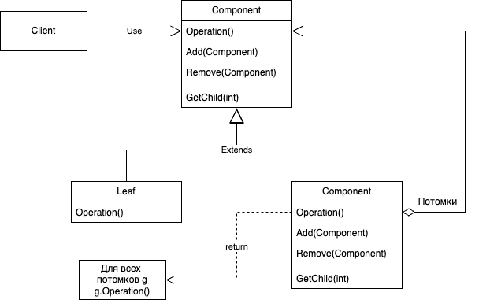

# Composite
## Название и классификация паттерна
Компоновщик - паттерн, структурирующий объекты.
## Назначение
Компонует объекты в древовидные структуры для представления иерархий часть-целое. Позволяет клиентам единообразно трактовать индивидуальные и составные объекты.
## Мотивация
Такие приложения, как графические редакторы и редакторы электрических схем, позволяют пользователям строить сложные диаграммы из более простых компонентов. Проектировщик может сгруппировать мелкие компоненты для формирования более крупных, которые, в свою очередь, могут стать основой для со здания еще более крупных. В простой реализации допустимо было бы определить классы графических примитивов, например текста и линий, а также классы, выступающие в роли контейнеров для этих примитивов. Но у такого решения есть существенный недостаток. Программа, в которой эти классы используются, должна поразному обращаться с примитивами и контейнерами, хотя пользователь чаще всего работает с ними единообразно. Необходимость различать эти объекты усложняет приложение. Паттерн компоновщик описывает, как можно применить рекурсивную композицию таким образом, что клиенту не придется проводить различие между простыми и составными объектами.

Ключом к паттерну компоновщик является абстрактный класс, который представляет одновременно и примитивы, и контейнеры. В графической системе этот класс может называться Graphic. В нем объявлены операции, специфичные для каждого вида графического объекта (такие как Draw) и общие для всех составных объектов, например операции для доступа и управления потомками.

Подклассы Line, Rectangle и Text (см. диаграмму выше) определяют примитивные графические объекты. В них операция Draw реализована соответственно для рисования прямых, прямоугольников и текста. Поскольку у примитивных объектов нет потомков, то ни один из этих подклассов не реализует операции, относящиеся к управлению потомками.

Класс Picture определяет агрегат, состоящий из объектов Graphic. Реализованная в нем операция Draw вызывает одноименную функцию для каждого потомка, а операции для работы с потомками уже не пусты. Поскольку интерфейс класса Picture соответствует интерфейсу Graphic, то в состав объекта Picture могут входить и другие такие же объекты.
## Применимость
Используйте паттерн компоновщик, когда:
- нужно представить иерархию объектов вида часть-целое
- хотите, чтобы клиенты единообразно трактовали составные и индивидуальные объекты
## Структура

## Участники
- Component - компонент:
  - объявляет интерфейс для компонуемых объектов
  - предоставляет подходящую реализацию операций по умолчанию, общую для всех классов
  - объявляет интерфейс для доступа к потомкам и управления ими
  - определяет интерфейс для доступа к родителю компонента в рекурсивной структуре и при необходимости реализует его. Описанная возможность необязательна
- Leaf - лист:
  - представляет листовые узлы композиции и не имеет потомков
  - определяет поведение примитивных объектов в композиции
- Composite - составной объект:
  - определяет поведение компонентов, у которых есть потомки
  - хранит компоненты-потомки
  - реализует относящиеся к управлению потомками операции в интерфейсе класса Component
- Client - клиент:
  - манипулирует объектами композиции через интерфейс Component
## Отношения
Клиенты используют интерфейс класса Component для взаимодействия с объектами в составной структуре. Если получателем запроса является листовый объект Leaf, то он и обрабатывает запрос. Когда же получателем является составной объект Composite, то обычно он перенаправляет запрос своим потомкам, возможно, выполняя некоторые дополнительные операции до или после перенаправления.
## Результаты
Паттерн компоновщик:
- определяет иерархии классов, состоящие из примитивных и составных объектов. Из примитивных объектов можно составлять более сложные, которые, в свою очередь, участвуют в более сложных композициях и так далее. Любой клиент, ожидающий примитивного объекта, может работать и с составным; 
- упрощает архитектуру клиента. Клиенты могут единообразно работать с индивидуальными и объектами и с составными структурами. Обычно клиенту неизвестно, взаимодействует ли он с листовым или составным объектом. Это упрощает код клиента, поскольку нет необходимости писать функции, ветвящиеся в зависимости от того, с объектом какого класса они работают; 
- облегчает добавление новых видов компонентов. Новые подклассы классов Composite или Leaf будут автоматически работать с уже существующими структурами и клиентским кодом. Изменять клиента при добавлении новых компонентов не нужно;
- способствует созданию общего дизайна. Однако такая простота добавления новых компонентов имеет и свои отрицательные стороны: становится трудно наложить ограничения на то, какие объекты могут входить в состав композиции. Иногда желательно, чтобы составной объект мог включать только определенные виды компонентов. Паттерн компоновщик не позволяет воспользоваться для реализации таких ограничений статической системой типов. Вместо этого следует проводить проверки во время выполнения.
## Реализация
При реализации паттерна компоновщик приходится рассматривать много вопросов:
- явные ссылки на родителей. Хранение в компоненте ссылки на своего родителя может упростить обход структуры и управление ею. Наличие такой ссылки облегчает передвижение вверх по структуре и удаление компонента. Кроме того, ссылки на родителей помогают поддержать паттерн цепочка обязанностей. Обычно ссылку на родителя определяют в классе Component. Классы Leaf и Composite могут унаследовать саму ссылку и операции с ней. При наличии ссылки на родителя важно поддерживать следующий инвариант: если некоторый объект в составной структуре ссылается на другой составной объект как на своего родителя, то для последнего первый является потомком. Простейший способ гарантировать соблюдение этого условия – изменять родителя компонента только тогда, когда он добавляется или удаляется из составного объекта. Если это удается один раз реализовать в операциях Add и Remove, то реализация будет унаследована всеми подклассами и, значит, инвариант будет поддерживаться автоматически; 
- разделение компонентов. Часто бывает полезно разделять компоненты, на пример для уменьшения объема занимаемой памяти. Но если у компонента может быть более одного родителя, то разделение становится проблемой. Возможное решение – позволить компонентам хранить ссылки на нескольких родителей. Однако в таком случае при распространении запроса по структуре могут возникнуть неоднозначности. Паттерн приспособленец показывает, как следует изменить дизайн, чтобы вовсе отказаться от хранения родителей. Работает он в тех случаях, когда потомки могут не посылать сообщений своим родителям, вынеся за свои границы часть внутреннего состояния; 
- максимизация интерфейса класса Component. Одна из целей паттерна компоновщик – избавить клиентов от необходимости знать, работают ли они с листовым или составным объектом. Для достижения этой цели класс Component должен сделать как можно больше операций общими для классов Composite и Leaf. Обычно класс Component предоставляет для этих операций реализации по умолчанию, а подклассы Composite и Leaf замещают их. Однако иногда эта цель вступает в конфликт с принципом проектирования иерархии классов, согласно которому класс должен определять только логичные для всех его подклассах операции. Класс Component поддерживает много операций, не имеющих смысла для класса Leaf. Как же тогда предоставить для них реализацию по умолчанию? Иногда, проявив изобретательность, удается перенести в класс Component операцию, которая, на первый взгляд, имеет смысл только для составных объектов. Например, интерфейс для доступа к потомкам является фундаментальной частью класса Composite, но вовсе не обязательно класса Leaf. Однако если рассматривать Leaf как Component, у которого никогда не бывает потомков, то мы можем определить в классе Component операцию доступа к потомкам как никогда не возвращающую потомков. Тогда подклассы Leaf могут использовать эту реализацию по умолчанию, а в подклассах Composite она будет переопределена, чтобы возвращать потомков. Операции для управления потомками довольно хлопотны, мы обсудим их в следующем разделе; 
- объявление операций для управления потомками. Хотя в классе Composite реализованы операции Add и Remove для добавления и удаления потомков, но для паттерна компоновщик важно, в каких классах эти операции объявлены. Надо ли объявлять их в классе Component и тем самым делать доступными в Leaf, или их следует объявить и определить только в классе Composite и его подклассах? 

Решая этот вопрос, мы должны выбирать между безопасностью и прозрачностью: 
- если определить интерфейс для управления потомками в корне иерархии классов, то мы добиваемся прозрачности, так как все компоненты удается трактовать единообразно. Однако расплачиваться приходится безопасностью, поскольку клиент может попытаться выполнить бессмысленное действие, например добавить или удалить объект из листового узла; 
- если управление потомками сделать частью класса Composite, то безопасность удастся обеспечить, ведь любая попытка добавить или удалить объекты из листьев в статически типизированном языке вроде C++ будет перехвачена на этапе компиляции. Но прозрачность мы утрачиваем, ибо у листовых и составных объектов оказываются разные интерфейсы.

В паттерне компоновщик мы придаем особое значение прозрачности, а не безопасности. Если для вас важнее безопасность, будьте готовы к тому, что иногда вы можете потерять информацию о типе и придется преобразовывать компонент к типу составного объекта. Как это сделать, не прибегая к небезопасным приведениям типов? Можно, например, объявить в классе Component операцию Composite* GetComposite(). Класс Component реализует ее по умолчанию, возвращая нулевой указатель. А в классе Composite эта операция переопределена и возвращает указатель this на сам объект.
- должен ли Component реализовывать список компонентов. Может возникнуть желание определить множество потомков в виде переменной экземпляра класса Component, в котором объявлены операции доступа и управления потомками. Но размещение указателя на потомков в базовом классе приводит к непроизводительному расходу памяти во всех листовых узлах, хотя у листа потомков быть не может. Такой прием можно применить, только если в структуре не слишком много потомков; 
- упорядочение потомков. Во многих случаях порядок следования потомков составного объекта важен. В рассмотренном выше примере класса Graphic под порядком может пониматься Zпорядок расположения потомков. В составных объектах, описывающих деревья синтаксического разбора, составные операторы могут быть экземплярами класса Composite, порядок следования потомков которых отражает семантику программы. Если порядок следования потомков важен, необходимо учитывать его при проектировании интерфейсов доступа и управления потомками. В этом может помочь паттерн итератор; 
- кэширование для повышения производительности. Если приходится часто обходить композицию или производить в ней поиск, то класс Composite может кэшировать информацию об обходе и поиске. Кэшировать разрешается либо полученные результаты, либо только информацию, достаточную для ускорения обхода или поиска. Например, класс Picture из примера, приведенного в разделе «Мотивация», мог бы кэшировать охватывающие прямоугольники своих потомков. При рисовании или выборе эта информация позволила бы пропускать тех потомков, которые не видимы в текущем окне. Любое изменение компонента должно делать кэши всех его родителей не действительными. Наиболее эффективен такой подход в случае, когда компонентам известно об их родителях. Поэтому, если вы решите воспользоваться кэшированием, необходимо определить интерфейс, позволяющий уведомить составные объекты о недействительности их кэшей; 
- кто должен удалять компоненты. В языках, где нет сборщика мусора, лучше всего поручить классу Composite удалять своих потомков в момент уничтожения. Исключением из этого правила является случай, когда листовые объекты постоянны и, следовательно, могут разделяться;
- какая структура данных лучше всего подходит для хранения компонентов. Составные объекты могут хранить своих потомков в самых разных структурах данных, включая связанные списки, деревья, массивы и хэштаблицы. Выбор структуры данных определяется, как всегда, эффективностью. Собственно говоря, вовсе не обязательно пользоваться какойлибо из универсальных структур. Иногда в составных объектах каждый потомок представляется отдельной переменной. Правда, для этого каждый подкласс Composite должен реализовывать свой собственный интерфейс управления памятью. См. пример в описании паттерна интерпретатор.
## Родственные паттерны
Отношение компонент-родитель используется в паттерне цепочка обязанностей.

Паттерн декоратор часто применяется совместно с компоновщиком. Когда декораторы и компоновщики используются вместе, у них обычно бывает общий родительский класс. Поэтому декораторам придется поддержать интерфейс компонентов такими операциями, как Add, Remove и GetChild.

Паттерн приспособленец позволяет разделять компоненты, но ссылаться на своих родителей они уже не могут.

Итератор можно использовать для обхода составных объектов. 

Посетитель локализует операции и поведение, которые в противном случае пришлось бы распределять между классами Composite и Leaf.
