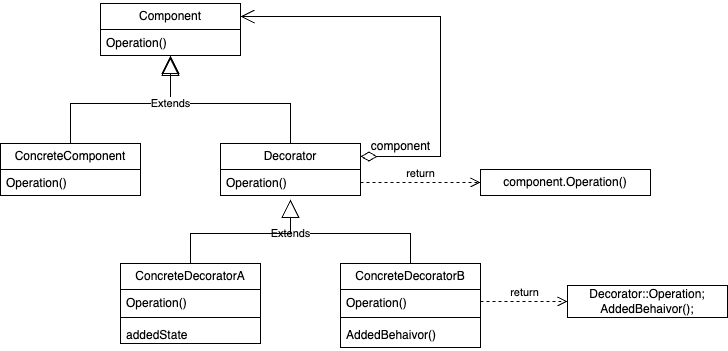

# Decorator
## Название и классификация паттерна
Декоратор - паттерн, структурирующий объекты
## Назначение
Динамически добавляет объекту новые обязанности. Является гибкой альтернативой порождению подклассов с целью расширения функциональности
## Alias
Wrapper (обёртка)
## Мотивация
Иногда бывает нужно возложить дополнительные обязанности на отдельный объект, а не на класс в целом. Так, библиотека для построения графических интерфейсов пользователя должна «уметь» добавлять новое свойство, скажем, рамку или новое поведение (например, возможность прокрутки к любому элементу интерфейса).

Добавить новые обязанности допустимо с помощью наследования. При наследовании классу с рамкой вокруг каждого экземпляра подкласса будет рисоваться рамка. Однако это решение статическое, а значит, недостаточно гибкое. Клиент не может управлять оформлением компонента рамкой.

Более гибким является другой подход: поместить компонент в другой объект, называемый декоратором, который как раз и добавляет рамку. Декоратор следует интерфейсу декорируемого объекта, поэтому его присутствие прозрачно для клиентов компонента. Декоратор переадресует запросы внутреннему компоненту, но может выполнять и дополнительные действия (например, рисовать рамку) до или после переадресации. Поскольку декораторы прозрачны, они могут вкладываться друг в друга, добавляя тем самым любое число новых обязанностей.

Предположим, что имеется объект класса TextView, который отображает текст в окне. По умолчанию TextView не имеет полос прокрутки, поскольку они не всегда нужны. Но при необходимости их удастся добавить с помощью декоратора ScrollDecorator. Допустим, что еще мы хотим добавить жирную сплошную рамку вокруг объекта TextView. Здесь может помочь декоратор BorderDecorator. Мы просто компонуем оба декоратора с BorderDecorator и получаем искомый результат.

Классы ScrollDecorator и BorderDecorator являются подклассами Decorator– абстрактного класса, который представляет визуальные компоненты, применяемые для оформления других визуальных компонентов.

VisualComponent – это абстрактный класс для представления визуальных объектов. В нем определен интерфейс для рисования и обработки событий. Отметим, что класс Decorator просто переадресует запросы на рисование своему компоненту, а его подклассы могут расширять эту операцию.

Подклассы Decorator могут добавлять любые операции для обеспечения необходимой функциональности. Так, операция ScrollTo объекта ScrollDecorator позволяет другим объектам выполнять прокрутку, если им известно о присутствии объекта ScrollDecorator. Важная особенность этого паттерна состоит в том, что декораторы могут употребляться везде, где возможно появление самого объекта VisualComponent. Поэтому клиент не может отличить декорированный объект от недекорированного, а значит, и никоим образом не зависит от наличия или отсутствия оформлений.
## Применимость
Используйте паттерн декоратор:
- для динамического, прозрачного для клиентов добавления обязанностей объектам; 
- для реализации обязанностей, которые могут быть сняты с объекта; 
- когда расширение путем порождения подклассов по каким-то причинам не удобно или невозможно. Иногда приходится реализовывать много независимых расширений, так что порождение подклассов для поддержки всех возможных комбинаций приведет к комбинаторному росту их числа. В других случаях определение класса может быть скрыто или почемулибо еще недоступно, так что породить от него подкласс нельзя.
## Структура

## Отношения
Decorator переадресует запросы объекту Component. Может выполнять и дополнительные операции и до, и после переадресации.
## Результаты
У паттерна декоратор есть, по крайней мере, 2 плюса и 2 минуса:
- большая гибкость, нежели у статического наследования. Паттерн декоратор позволяет более гибко добавлять объекту новые обязанности, чем было бы возможно в случае статического (множественного) наследования. Декоратор может добавлять и удалять обязанности во время выполнения программы. При использовании же наследования требуется создавать новый класс для каждой дополнительной обязанности (например, BorderedScrollableTextView, BorderedTextView), что ведет к увеличению числа классов и, как следствие, к возрастанию сложности системы. Кроме того, применение нескольких декораторов к одному компоненту позволяет произвольным образом сочетать обязанности. Декораторы позволяют легко добавить одно и то же свойство дважды. Например, чтобы окружить объект TextView двойной рамкой, нужно просто добавить два декоратора BorderDecorators. Двойное наследование классу Border в лучшем случае чревато ошибками; 
- позволяет избежать перегруженных функциями классов на верхних уровнях иерархии. Декоратор разрешает добавлять новые обязанности по мере необходимости. Вместо того чтобы пытаться поддержать все мыслимые возможности в одном сложном, допускающем разностороннюю настройку классе, вы можете определить простой класс и постепенно наращивать его функциональность с помощью декораторов. В результате приложение уже не платит за неиспользуемые функции. Нетрудно также определять новые виды декораторов независимо от классов, которые они расширяют, даже если первоначально такие расширения не планировались. При расширении же сложного класса обычно приходится вникать в детали, не имеющие отношения к добавляемой функции; 
- декоратор и его компонент не идентичны. Декоратор действует как прозрачное обрамление. Но декорированный компонент все же не идентичен исходному. При использовании декораторов это следует иметь в виду; 
- множество мелких объектов. При использовании в проекте паттерна декоратор нередко получается система, составленная из большого числа мелких объектов, которые похожи друг на друга и различаются только способом взаимосвязи, а не классом и не значениями своих внутренних переменных. Хотя проектировщик, разбирающийся в устройстве такой системы, может легко настроить ее, но изучать и отлаживать ее очень тяжело.
## Реализация
Применение паттерна декоратор требует рассмотрения нескольких вопросов:
- соответствие интерфейсов. Интерфейс декоратора должен соответствовать интерфейсу декорируемого компонента. Поэтому классы ConcreteDecorator должны наследовать общему классу (по крайней мере, в C++); 
- отсутствие абстрактного класса Decorator. Нет необходимости определять абстрактный класс Decorator, если планируется добавить всего одну обязанность. Так часто происходит, когда вы работаете с уже существующей иерархией классов, а не проектируете новую. В таком случае ответственность за переадресацию запросов, которую обычно несет класс Decorator, можно возложить непосредственно на ConcreteDecorator; 
- облегченные классы Component. Чтобы можно было гарантировать соответствие интерфейсов, компоненты и декораторы должны наследовать общему классу Component. Важно, чтобы этот класс был настолько легким, насколько возможно. Иными словами, он должен определять интерфейс, а не хранить данные. В противном случае декораторы могут стать весьма тяжеловесными, и применять их в большом количестве будет накладно. Включение большого числа функций в класс Component также увеличивает вероятность, что конкретным подклассам придется платить за то, что им не нужно; 
- изменение облика, а не внутреннего устройства объекта. Декоратор можно рассматривать как появившуюся у объекта оболочку, которая изменяет его поведение. Альтернатива – изменение внутреннего устройства объекта, хорошим примером чего может служить паттерн стратегия. Стратегии лучше подходят в ситуациях, когда класс Component уже достаточно тяжел, так что применение паттерна декоратор обходится слишком дорого. В паттерне стратегия компоненты передают часть своей функциональности отдельному объекту-стратегии, поэтому изменить или расширить поведение компонента допустимо, заменив этот объект. Например, мы можем поддержать разные стили рамок, поручив рисование рамки специальному объекту Border. Объект Border является примером объекта-стратегии: в данном случае он инкапсулирует стратегию рисования рамки. Число стратегий может быть любым, поэтому эффект такой же, как от рекурсивной вложенности декораторов. Например, в системах MacApp 3.0 [App89] и Bedrock [Sym93a] графические компоненты, называемые видами (views), хранят список объектов-оформителей (adorner), которые могут добавлять различные оформления вроде границ к виду. Если к виду присоединены такие объекты, он дает им возможность выполнить свои функции. MacApp и Bedrock вынуждены предоставить доступ к этим операциям, поскольку класс View весьма тяжел. Было бы слишком расточительно использовать полномасштабный объект этого класса только для того, чтобы добавить рамку. Поскольку паттерн декоратор изменяет лишь внешний облик компонента, последнему ничего не надо «знать» о своих декораторах, то есть декораторы прозрачны для компонента. В случае стратегий самому компоненту известно о возможных расширениях. Поэтому он должен располагать информацией обо всех стратегиях и ссылаться на них. При использовании подхода, основанного на стратегиях, может возникнуть необходимость модифицировать компонент, чтобы он соответствовал новому расширению. С другой стороны, у стратегии может быть свой собственный специализированный интерфейс, тогда как интерфейс декоратора должен повторять интерфейс компонента. Например, стратегии рисования рамки необходимо определить всего лишь интерфейс для этой операции (DrawBorder, GetWidth и т.д.), то есть класс стратегии может быть легким, несмотря на тяжеловесность компонента. Системы MacApp и Bedrock применяют такой подход не только для оформления видов, но и для расширения особенностей поведения объектов, связанных с обработкой событий. В обеих системах вид ведет список объектов поведения, которые могут модифицировать и перехватывать события. Каждому зарегистрированному объекту поведения вид предоставляет возможность обработать событие до того, как оно будет передано незарегистрированным объектам такого рода, за счет чего достигается переопределение поведения. Можно, например, декорировать вид специальной поддержкой работы с клавиатурой, если зарегистрировать объект поведения, который перехватывает и обрабатывает события нажатия клавиш.
## Родственные паттерны
[Адаптер](../adapter/description.md): если декоратор изменяет только обязанности объекта, но не его интерфейс, то адаптер придает объекту совершенно новый интерфейс.

[Компоновщик](../composite/description.md): декоратор можно считать вырожденным случаем составного объекта, у которого есть только один компонент. Однако декоратор добавляет новые обязанности, агрегирование объектов не является его целью.

Стратегия: декоратор позволяет изменить внешний облик объекта, стратегия – его внутреннее содержание. Это два взаимодополняющих способа изменения объекта.
