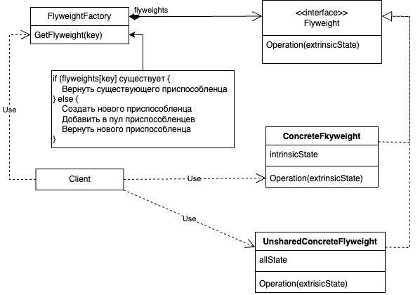

# Flyweight
## Название
Приспособленец - паттерн, структурирующий объекты.
## Назначение
Использует разделение для эффективной поддержки множества мелких объектов.
## Мотивация
В некоторых приложениях использование объектов могло бы быть очень полезным, но прямолинейная реализация оказывается недопустимо расточительной.

Например, в большинстве редакторов документов имеются средства форматирования и редактирования текстов, в той или иной степени модульные. Объектно-ориентированные редакторы обычно применяют объекты для представления таких встроенных элементов, как таблицы и рисунки. Но они не используют объекты для представления каждого символа, несмотря на то что это увеличило бы гибкость на самых нижних уровнях приложения. Ведь тогда к рисованию и форматированию символов и встроенных элементов можно было бы применить единообразный подход. И для поддержки новых наборов символов не пришлось бы как-либо затрагивать остальные функции редактора. Да и общая структура приложения отражала бы физическую структуру документа. На следующей диаграмме показано, как редактор документов мог бы воспользоваться объектами для представления символов.

У такого дизайна есть один недостаток – стоимость. Даже в документе скромных размеров было бы несколько сотен тысяч объектовсимволов, а это привело бы к расходованию огромного объема памяти и неприемлемым затратам во время выполнения. Паттерн приспособленец показывает, как разделять очень мелкие объекты без недопустимо высоких издержек.

Приспособленец – это разделяемый объект, который можно использовать одновременно в нескольких контекстах. В каждом контексте он выглядит как не зависимый объект, то есть неотличим от экземпляра, который не разделяется. Приспособленцы не могут делать предположений о контексте, в котором работают. Ключевая идея здесь – различие между внутренним и внешним состояниями. Внутреннее состояние хранится в самом приспособленце и состоит из информации, не зависящей от его контекста. Именно поэтому он может разделяться. Внешнее состояние зависит от контекста и изменяется вместе с ним, поэтому не подлежит разделению. Объектыклиенты отвечают за передачу внешнего состояния приспособленцу, когда в этом возникает необходимость.

Приспособленцы моделируют концепции или сущности, число которых слишком велико для представления объектами. Например, редактор документов мог бы создать по одному приспособленцу для каждой буквы алфавита. Каждый приспособленец хранит код символа, но координаты положения символа в документе и стиль его начертания определяются алгоритмами размещения текста и командами форматирования, действующими в том месте, где символ появляется. Код символа – это внутреннее состояние, а все остальное – внешнее.

Логически для каждого вхождения данного символа в документ существует объект. Физически, однако, есть лишь по одному объекту-приспособленцу для каждого символа, который появляется в различных контекстах в структуре документа. Каждое вхождение данного объекта-символа ссылается на один и тот же экземпляр в разделяемом пуле объектов-приспособленцев.

Ниже изображена структура класса для этих объектов. Glyph– это абстрактный класс для представления графических объектов (некоторые из них могут быть приспособленцами). Операции, которые могут зависеть от внешнего состояния, передают его в качестве параметра. Например, операциям Draw (рисование) и Intersects (пересечение) должно быть известно, в каком контексте встречается глиф, иначе они не смогут выполнить то, что от них требуется.

Приспособленец, представляющий букву «a», содержит только соответствующий ей код; ни положение, ни шрифт буквы ему хранить не надо. Клиенты передают приспособленцу всю зависящую от контекста информацию, которая нужна, чтобы он мог изобразить себя. Например, глифу Row известно, где его потомки должны себя показать, чтобы это выглядело как горизонтальная строка. Поэтому вместе с запросом на рисование он может передавать каждому потомку координаты.

Поскольку число различных объектов-символов гораздо меньше, чем число символов в документе, то и общее количество объектов существенно меньше, чем было бы при простой реализации. Документ, в котором все символы изображаются одним шрифтом и цветом, создаст порядка 100 объектов-символов (это примерно равно числу кодов в таблице ASCII) независимо от своего размера. А поскольку в большинстве документов применяется не более десятка различных комбинаций шрифта и цвета, то на практике эта величина возрастет несущественно. Поэтому абстракция объекта становится применимой и к отдельным символам.
## Применимость
Эффективность паттерна приспособленец во многом зависит от того, как и где он используется. Применяйте этот паттерн, когда выполнены __все__ нижеперечисленные условия:
- в приложении используется большое кол-во объектов
- из-за этого накладные расходы на хранение высоки
- большую часть состояния объектов можно вынести вовне
- многие группы объектов можно заменить относительно небольшим кол-вом разделяемых объектов, поскольку внешнее состояние вынесено
- приложение не зависит от идентичности объекта. Поскольку объекты-приспособленцы могут разделяться, то проверка на идентичность возвратит "истину" для концептуально различных объектов
## Структура

## Участники
- Flyweight - приспособленец:
  - объявляет интерфейс, с помощью которого приспособленцы могут получать внешнее состояние или как-то воздействовать через него
- ConcreteFlyweight - конкретный приспособленец:
  - Реализует интерфейс класса Flyweight и добавляет при необходимости внутреннее состояние. Объект класса ConcreteFlyweight должен быть разделяемым. Любое сохраняемое им состояние должно быть внутренним, то есть не зависящим от контекста
- UnsharedConcreteFlyweight - неразделяемый конкретный приспособленец:
  - не все подклассы Flyweight обязательно должны быть разделяемыми. Интерфейс Flyweight допускает разделение, но не навязывает его. Часто у объектов UnsharedConcreteFlyweight на некотором уровне структуры приспособленца есть потомки в виде объектов класса ConcreteFlyweight
- FlyweightFactory - фабрика приспособленцев:
  - создаёт объекты-приспособленцы и управляет ими
  - обеспечивает должное разделение приспособленцев. Когда клиент запрашивает приспособленца, объект FlyweightFactory предоставляет существующий экземпляр или создаёт новый, если готового ещё нет
- Client - клиент:
  - хранит ссылки на одного или несколько приспособленцев
  - вычисляет или хранит внешнее состояние приспособленцев
## Отношения
- состояние, необходимое приспособленцу для нормальной работы, можно охарактеризовать как внутреннее или внешнее. Первое хранится в самом объекте ConcreteFlyweight. Внешнее состояние хранится или вычисляется клиентами. Клиент передает его приспособленцу при вызове операций; 
- клиенты не должны создавать экземпляры класса ConcreteFlyweight напрямую, а могут получать их только от объекта FlyweightFactory. Это позволит гарантировать корректное разделение.
## Реализация
При использовании приспособленцев не исключены затраты на передачу, поиск или вычисление внутреннего состояния, особенно если раньше оно хранилось как внутреннее. Однако такие расходы с лихвой компенсируются экономией памяти за счет разделения объектов-приспособленцев.

Экономия памяти возникает по ряду причин:
- уменьшение общего числа экземпляров;
- сокращение объема памяти, необходимого для хранения внутреннего состояния;
- вычисление, а не хранение внешнего состояния (если это действительно так).

Чем выше степень разделения приспособленцев, тем существеннее экономия. С увеличением объема разделяемого состояния экономия также возрастает. Самого большого эффекта удается добиться, когда суммарный объем внутренней и внешней информации о состоянии велик, а внешнее состояние вычисляется, а не хранится. Тогда разделение уменьшает стоимость хранения внутреннего состояния, а за счет вычислений сокращается память, отводимая под внешнее состояние.

Паттерн приспособленец часто применяется вместе с [компоновщиком](../composite/description.md) для представления иерархической структуры в виде графа с разделяемыми листовыми узлами. Из-за разделения указатель на родителя не может храниться в листовом узле-приспособленце, а должен передаваться ему как часть внешнего состояния. Это оказывает заметное влияние на способ взаимодействия объектов иерархии между собой.
## Родственные паттерны
Паттерн приспособленец часто используется в сочетании с [компоновщиком](../composite/description.md) для реализации иерархической структуры в виде ациклического направленного графа с разделяемыми листовыми вершинами.

Часто наилучшим способом реализации объектов состояния и стратегии является паттерн приспособленец.
