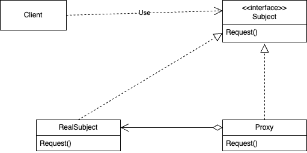

# Proxy
## Название и классификация паттерна
Заместитель - паттерн, структурирующий объекты
## Назначение
Является суррогатом другого объекта и контролирует доступ к нему
## Alias
Surrogate (суррогат)
## Мотивация
Разумно управлять доступом к объекту, поскольку тогда можно отложить расходы на создание и инициализацию до момента, когда объект действительно понадобится. Рассмотрим редактор документов, который допускает встраивание в документ графических объектов. Затраты на создание некоторых таких объектов, например больших растровых изображений, могут быть весьма значительны. Но документ должен открываться быстро, поэтому следует избегать создания всех «тяжелых» объектов на стадии открытия (да и вообще это излишне, поскольку не все они будут видны одновременно).

В связи с такими ограничениями кажется разумным создавать «тяжелые» объекты по требованию. Это означает «когда изображение становится видимым». Но что поместить в документ вместо изображения? И как, не усложняя реализации редактора, скрыть то, что изображение создается по требованию? Например, оптимизация не должна отражаться на коде, отвечающем за рисование и форматирование.

Решение состоит в том, чтобы использовать другой объект – заместитель изображения, который временно подставляется вместо реального изображения. Заместитель ведет себя точно так же, как само изображение, и выполняет при необходимости его инстанцирование.

Заместитель создает настоящее изображение, только если редактор документа вызовет операцию Draw. Все последующие запросы заместитель переадресует непосредственно изображению. Поэтому после создания изображения он должен сохранить ссылку на него.

Предположим, что изображения хранятся в отдельных файлах. В таком случае мы можем использовать имя файла как ссылку на реальный объект. Заместитель хранит также размер изображения, то есть длину и ширину. «Зная» ее, заместитель может отвечать на запросы форматера о своем размере, не инстанцируя изображение.

Редактор документов получает доступ к встроенным изображениям только через интерфейс, определенный в абстрактном классе Graphic. ImageProxy – это класс для представления изображений, создаваемых по требованию. В ImageProxy хранится имя файла, играющее роль ссылки на изображение, которое находится на диске. Имя файла передается конструктору класса ImageProxy.

В объекте ImageProxy находятся также ограничивающий прямоугольник изображения и ссылка на экземпляр реального объекта Image. Ссылка остается недействительной, пока заместитель не инстанцирует реальное изображение. Операцией Draw гарантируется, что изображение будет создано до того, как заместитель переадресует ему запрос. Операция GetExtent переадресует запрос изображению, только если оно уже инстанцировано; в противном случае ImageProxy возвращает размеры, которые хранит сам.
## Применимость
Паттерн заместитель применим во всех случаях, когда возникает необходимость сослаться на объект более изощренно, чем это возможно, если использовать простой указатель. Вот несколько типичных ситуаций, где заместитель оказывается полезным:
- удаленный заместитель предоставляет локального представителя вместо объекта, находящегося в другом адресном пространстве. В системе NEXTSTEP для этой цели применяется класс NXProxy. Заместителя такого рода Джеймс Коплиен называет «послом»;
- виртуальный заместитель создает «тяжелые» объекты по требованию. Примером может служить класс ImageProxy, описанный в разделе «Мотивация»;
- защищающий заместитель контролирует доступ к исходному объекту. Такие заместители полезны, когда для разных объектов определены различные права доступа. Например, в операционной системе Choices объекты KernelProxy ограничивают права доступа к объектам операционной системы;
- «умная» ссылка – это замена обычного указателя. Она позволяет выполнить дополнительные действия при доступе к объекту. К типичным применениям такой ссылки можно отнести:
  - подсчет числа ссылок на реальный объект, с тем чтобы занимаемую им память можно было освободить автоматически, когда не останется ни одной ссылки (такие ссылки называют еще «умными» указателями);
  - загрузку объекта в память при первом обращении к нему; 
  - проверку и установку блокировки на реальный объект при обращении к нему, чтобы никакой другой объект не смог в это время изменить его.
## Структура

## Участники
- Proxy - заместитель:
  - хранит ссылку, которая позволяет заместителю обратиться к реальному субъекту. Объект класса Proxy может обращаться к объекту класса Subject, если интерфейсы классов RealSubject и Subject одинаковы;
  - предоставляет интерфейс, идентичный интерфейсу Subject, так что заместитель всегда может быть подставлен вместо реального субъекта;
  - контролирует доступ к реальному субъекту и может отвечать за его создание и удаление;
  - прочие обязанности зависят от вида заместителя:
    - удаленный заместитель отвечает за кодирование запроса и его аргументов и отправление закодированного запроса реальному субъекту в другом адресном пространстве;
    - виртуальный заместитель может кэшировать дополнительную информацию о реальном субъекте, чтобы отложить его создание. Например, класс ImageProxy из раздела «Мотивация» кэширует размеры реального изображения;
    - защищающий заместитель проверяет, имеет ли вызывающий объект необходимые для выполнения запроса права;
- Subject (Graphic) – субъект:
  - определяет общий для RealSubject и Proxy интерфейс, так что класс Proxy можно использовать везде, где ожидается RealSubject; 
- RealSubject (Image) – реальный субъект:
  - определяет реальный объект, представленный заместителем.
## Отношения
Proxy при необходимости переадресует запросы объекту RealSubject. Детали зависят от вида заместителя.
## Результаты
С помощью паттерна заместитель при доступе к объекту вводится дополнительный уровень косвенности. У этого подхода есть много вариантов в зависимости от вида заместителя:
- удаленный заместитель может скрыть тот факт, что объект находится в другом адресном пространстве;
- виртуальный заместитель может выполнять оптимизацию, например создание объекта по требованию;
- защищающий заместитель и «умная» ссылка позволяют решать дополнительные задачи при доступе к объекту.

Есть еще одна оптимизация, которую паттерн заместитель иногда скрывает от клиента. Она называется копированием при записи (copy-on-write) и имеет много общего с созданием объекта по требованию. Копирование большого и сложного объекта – очень дорогая операция. Если копия не модифицировалась, то нет смысла эту цену платить. Если отложить процесс копирования, применив заместитель, то можно быть уверенным, что эта операция произойдет только тогда, когда он действительно был изменен.

Чтобы во время записи можно было копировать, необходимо подсчитывать ссылки на субъект. Копирование заместителя просто увеличивает счетчик ссылок. И только тогда, когда клиент запрашивает операцию, изменяющую субъект, заместитель действительно выполняет копирование. Одновременно заместитель должен уменьшить счетчик ссылок. Когда счетчик ссылок становится равным нулю, субъект уничтожается.

Копирование при записи может существенно уменьшить плату за копирование «тяжелых» субъектов.
## Родственные паттерны
Паттерн [адаптер](../adapter/description.md) предоставляет другой интерфейс к адаптируемому объекту. Напротив, заместитель в точности повторяет интерфейс своего субъекта. Однако, если заместитель используется для ограничения доступа, он может отказаться выполнять операцию, которую субъект выполнил бы, поэтому на самом деле интерфейс заместителя может быть и подмножеством интерфейса субъекта.

Несколько замечаний относительно [декоратора](../decorator/description.md). Хотя его реализация и похожа на реализацию заместителя, но назначение совершенно иное. Декоратор добавляет объекту новые обязанности, а заместитель контролирует доступ к объекту.

Степень схожести реализации заместителей и декораторов может быть раз личной. Защищающий заместитель мог бы быть реализован в точности как декоратор. С другой стороны, удаленный заместитель не содержит прямых ссылок на реальный субъект, а лишь косвенную ссылку, что-то вроде «идентификатор хоста и локальный адрес на этом хосте». Вначале виртуальный заместитель имеет только косвенную ссылку (скажем, имя файла), но в конечном итоге получает и использует прямую ссылку.
